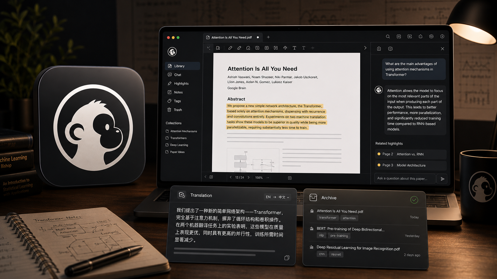

# DeepRead



DeepRead 是一款面向论文精读的桌面应用。核心在于：你向 AI 提出的每个问题，都锚定在当时划选的那段原文上——问答不会像普通聊天一样转瞬即逝，而是钉在原文的对应位置。除此之外，它还能把本地论文按研究主题整理，并在读完后通过阅读回顾帮你梳理某个方向的研究进展，让每一次精读都沉淀成可回溯的知识。

## 下载流程

### 1. 使用前准备

AI 问答会调用你本机已经安装并登录的命令行工具。使用前请至少准备其中一种：

- Claude Code：确认终端中可以运行 `claude`
- Codex CLI：确认终端中可以运行 `codex`

### 2. 下载应用

最新版本为 **0.1.18**，请前往 [v0.1.18 Releases 页面](https://github.com/zhikangSu/ArticleRead/releases/tag/v0.1.18) 下载与你的系统对应的安装包。

| 系统 | 架构 | 推荐安装包 |
| --- | --- | --- |
| macOS | Apple Silicon / arm64 | `ArticleRead-0.1.18-arm64.dmg` |
| Linux | x64 / amd64 | `articleread-linux-desktop_0.1.18_amd64.deb` |

### 3. 安装

#### macOS

1. 打开下载的 `ArticleRead-0.1.18-arm64.dmg`。
2. 将 `ArticleRead.app` 拖入 `/Applications` 文件夹。
3. 从“应用程序”中打开 DeepRead。

如果首次打开时 macOS 提示“文件已损坏”或“无法打开”，请在终端中运行：

```bash
sudo xattr -rd com.apple.quarantine "/Applications/ArticleRead.app"
```

命令执行完成后，重新打开 DeepRead。

#### Linux

使用 deb 安装包：

```bash
sudo dpkg -i articleread-linux-desktop_0.1.18_amd64.deb
```

如果不想安装 deb 包，可以在同一 Releases 页面下载 `ArticleRead-0.1.18.AppImage` 并直接运行：

```bash
chmod +x ArticleRead-0.1.18.AppImage
./ArticleRead-0.1.18.AppImage
```

### 4. 首次启动

1. 按照首次启动引导完成基础配置。
2. 在设置中选择已安装并登录的 Claude Code 或 Codex CLI。
3. 如需使用 Notion 归档，在设置中完成 Notion 授权。
4. 导入本地 PDF 或添加 arXiv 论文，开始阅读。

### 5. 应用更新

从 0.1.13 起，DeepRead 支持应用内内核更新。兼容当前桌面壳的功能更新可在设置页一键下载，重启应用后生效；更新失败时会自动回退。

## 产品功能

### 本地论文库

- 导入和管理本地 PDF，并识别 arXiv 论文的标题、作者、发表日期等元数据。
- 通过“阅读中”和“已读完”状态跟踪阅读进度，支持手动修正发表日期和调整论文卡片大小。
- 按研究主题组织论文，并可拖拽论文卡片进行整理。

### 论文精读

- 在应用内阅读原文 PDF、译文 PDF，或使用分屏模式对照阅读。
- 选中文本后自动翻译。
- 从选区直接发起 AI 提问，提问卡片可拖动、缩放，并会根据页面留白自动选择合适位置。
- 每个 AI 提问都与对应的原文选区关联，并支持围绕同一内容继续追问。

### 阅读回顾与知识归档

- 汇总阅读节奏和主题分布，按 1、3、6 或 12 个月回顾论文阅读情况。
- 使用 AI 对阅读记录进行反思和总结，帮助梳理阶段性研究脉络。
- 通过 Notion 集成将论文信息、问答和阅读成果归档到个人知识库。

如遇到安装、阅读、问答或 Notion 集成问题，欢迎通过 [GitHub Issues](https://github.com/zhikangSu/ArticleRead/issues) 反馈。
